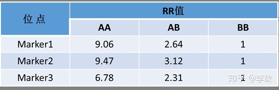
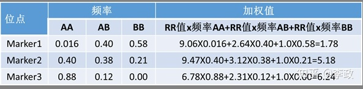
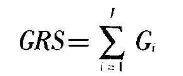
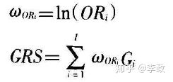
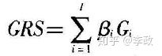
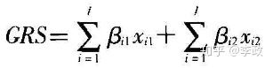
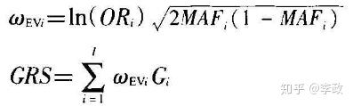

# 常见基因检测疾病风险评估算法总结

> https://zhuanlan.zhihu.com/p/49762423

随着对疾病研究的不断深入，目前对复杂疾病发生风险评估的遗传分析技术主要基于两种理论：位点微效累加理论和主要位点决定论。而基于位点微效累加理论的算法模型主要有两大类，分别是美国Navigenics公司为典型代表的CGR(combined genetic risk)疾病风险度评估模型和由CINFA制药公司开发的GRS（Genetic risk score）疾病遗传风险评分模型。下面分别对这两类模型算法进行介绍。

## 1. CGR模型
### 1.1 模型算法举例说明

1）如某一疾病已知报道有3个基因位点与疾病的发病率相关，这三个点分别是Marker1、Marker2和Marker3。因为OR值容易过高评估疾病的风险度，所以我们根据资料中疾病的频率和疾病的发病率等数据，将每个位点的OR值转换成相对风险（RR）值。

假设每个基因位点的危险等位基因为A,非危险等位基因为B,则其经过转换的RR值见表1。

> 表1 复杂疾病RR值比较

2） 每个位点的加权值基于位点的RR值和基因型对应的频率计算得出（表2）。

> 表2 复杂疾病发生风险加权值

3）所有位点的总加权值根据每个位点的加权值得出。总加权值=``1.78 x 5.18 x 6.24 = 57.54``。

4）根据每个个体的基因分型结果，计算个体的实际加权值。假如该个体的基因型在Marker1上是AB，在Marker2上是AA，在Marker1上是AA，那么该个体的实际加权值为：RRAB1XRRAA2XRRAA3=2.64X9.47X6.78=169.51.

5）计算该个体的CGR值。``CGR=169.51/57.74=2.94``。

6）计算个体的实际发病率。假设改疾病的群体发病率为3.1%，那么该个体的实际发病率为``2.94 x 3.1%=9%``。

针对某一疾病，通过计算千人基因组数据库（1000 genomes）中某一人群各样品的CGR值及该疾病在该人群中的发病率划分群体风险等级。对于接受检测的个体，计算各易感位点的遗传风险值进而求得CGR值，比较确定与疾病相关的各检测位点的风险状态及疾病的发病风险等级。另外需要说明的是，RR值多用于队列研究而OR值用于病例对照研究，OR值因不能计算发病率，所以不能计算相对风险度，只能用RR值作为反映关联强度的指标。在不同发病率情况下，OR值与RR值有差别，但当疾病发病率小于5%时，OR值是RR值的极好近似值。

### 1.2 该模型的优缺点

CGR疾病风险度评估模型根据不同的风险等位基因位点对疾病发生风险影响的权重及其各基因型频率经过加权计算出疾病对的综合风险值。在实践过程中，由于CGR模型预测的准确性较高而受到普遍欢迎。然而该模型成立需要一定的条件。首先，要提高模型预测的准确性必须先获得研究对象所属种群的易感基因型频率；其次，该模型默认为每个基因均独立作用，忽略了基因间的相互作用；再次，CGR模型主要根据高频SNP进行预测，忽略了低频SNP和拷贝数变异，而最近的研究表明后两种变异形式对复杂疾病发病的影响不可小觑。因此CGR模型可能会造成遗传度缺失从而降低预测的准确性。最后CGR模型的风险度评估假设OR值及发病率已知，缩小了可预测的范围。所以在实际运用该模型时，应注意其适用范围。

## 2. GRS模型

GRS模型纳入遗传易感因素进行风险评分，从而评价遗传易感因素在风险预测模型中的效果。GRS 能整合多个SNPs的综合信息来评价基因序列变异和疾病之间的联系，且重复性较好。通过计算待检测个体的GRS得分并与所属人群数据库中人群GRS得分均值进行比较，即可得只该个体的患病风险的大小。

GRS模型中常用的算法包括以下五种：简单相加遗传风险评分（SC-GRS），以OR值作为权重的遗传风险评分(OR-GRS)，直接基于logistic回归的遗传风险评分(DL-GRS)，多基因遗传风险评分(PG-GRS)，可释方差遗传风险评分(EV-GRS)。现分别介绍各方法的算法及优缺点，其中方法涉及的公式中，以G表示一组遗传易感位点风险等位基因数的集合向量（Gi表示第i个遗传易感位点的风险等位基因数量）。

#### 2.1 SC-GRS

是最简单的GRS方法，其计算方法不涉及任何SNP效应的先验信息，即为所有SNP风险等位基因数量的和（见如下公式）：

该方法通俗易懂，计算简单，因此在早期研究种应用较多，尤其是在SNP效应不能稳定估计的时候更为适用。但是，此方法假设所有SNP对疾病具有相同效应，而该假设在现实研究种几乎不可能存在，因此，在建立疾病风险预测模型研究种很少使用。

#### 2.2 OR-GRS

相比与SC-GRS，该方法考虑SNP对疾病的不同效应，以SNP效应作为权重，计算所有纳入模型SNP的OR值权重，公式如下：

为预先约定固定权重，实际应用中，往往使用大样本量、可靠性好的研究（如Meta分析）中对数转化后的单风险等位基因OR值作为权重。该方法中具有较大OR值的SNP对疾病风险贡献更大。其假设更为合理，因此被广泛应用于疾病风险模型预测的研究中，但因其估计依赖外部信息，不适用于一些不能准确估计SNP效应的研究。

#### 2.3 DL-GRS

该方法类似OR-GRS,但是基于的权重来自于已有原始数据，利用这些数据拟合logistic回归模型，以模型中估计的SNP效应作为权重，计算所有纳入模型SNP的OR值权重和公式：

该方法仅依赖于现有数据，不需要外部研究的OR值作为权重，但随之而来的问题即是该评分用于外部数据的可靠性有待商榷。该方法常常应用于与无法通过外部信息准确估计SNP效应的研究。但是当该评分应用于另一个独立的数据时，其拟合的效果往往不如其在建立该评分的数据中拟合的效果。

#### 2.4 PG-GRS

类似于DL-GRS，该方法依赖于现有数据。与以上GRS估计方法不同，该方法以哑变量的形式考虑每个SNP,即应用遗传模型中的共显性模型。

式中xi1代表SNPi的杂合型，xi2代表SNPi的风险等位基因纯合型。该假设下，以哑变量的形式将AA编码为00，Aa编码为10，aa编码为01，将AA作为参考基因型，分别为Aa，aa基因型的风险系数。SNP遗传模型不能确定时，该评分方法较为适用。尽管如此，在涉及大量SNP时，需要估计的参数数量、模型的复杂度也大大增加。此外，该方法基于现有数据，因此同样要面临外部验证的问题。

#### 2.5 EV-GRS

是基于既往的风险评分方法，同时纳入考虑了SNP效应和最小等位基因频率（MAF）。除已经报道的SNP效应外，该方法在权重中增加了最小等位基因部分，其相关疾病模型如下所示。

MAF可以来源于既往对应人群的公共数据库，如dbSNP、1000 Genomes计划等。该方法认为，对于每个SNP，SNP效应和MAF均为衡量其对疾病贡献的重要因素，当OR值固定时，疾病风险将随着MAF增加而增加。该方法在模拟数据中表现出了比较好的效果，但是尚无实际数据的应用评价结果，该遗传风险评分的效果有待进一步论证。